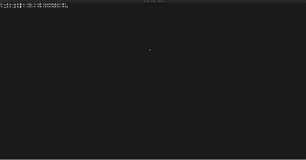

# MITRE ATT&CK Navigator Layer Generator

This PowerShell script is designed to generate a MITRE ATT&CK Navigator layer template JSON with technique IDs from a specified text file. It allows customization of the assigned scores and colors for each technique and saves the updated JSON to a specified output file.

## Features

- Read technique IDs from a user-defined text file.
- Define the score and color assigned to each technique in the Navigator.
- Output the updated layer to a specified file.

## Usage

To use the script, clone this repository and run the script with the required parameters. Refer to the script's comment-based help for more detailed usage information.



## Requirements

Windows PowerShell 5.0 or higher.
PowerShell 7 or higher.

## Installation

No installation is required. Just clone this repository to your local machine:

```bash
git clone https://github.com/n0isegat3/Invoke-MITREATTACKNavGenerator.git
```

## Contributing

Contributions to this script are welcome. Please fork the repository, make your changes, and submit a pull request.

## Author

This script was developed by Jan Marek of Cyber Rangers. For more information, visit Cyber Rangers https://www.cyber-rangers.com.

## License

This project is licensed under the GNU General Public License v3.0 - see the LICENSE file for details or visit GNU GPL 3.0 License.